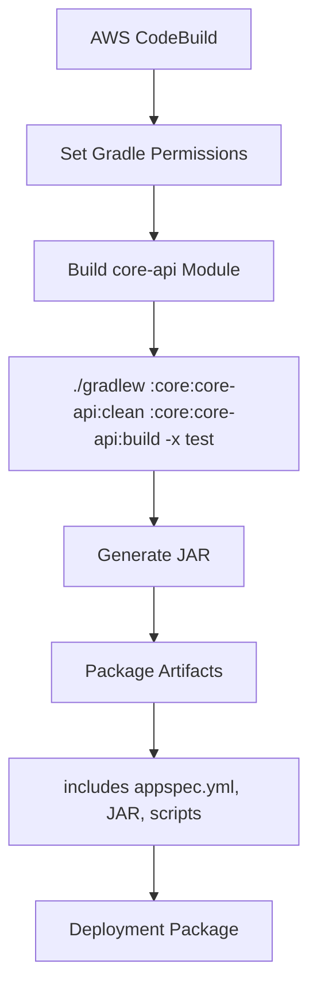
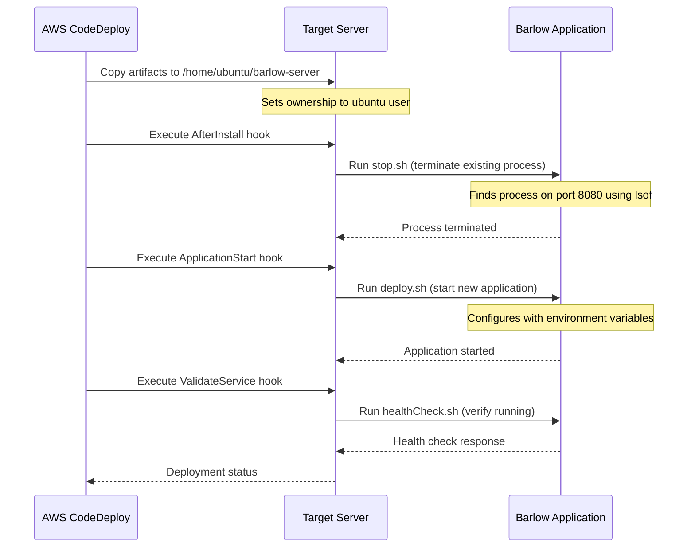
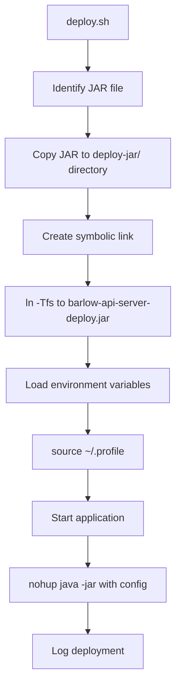
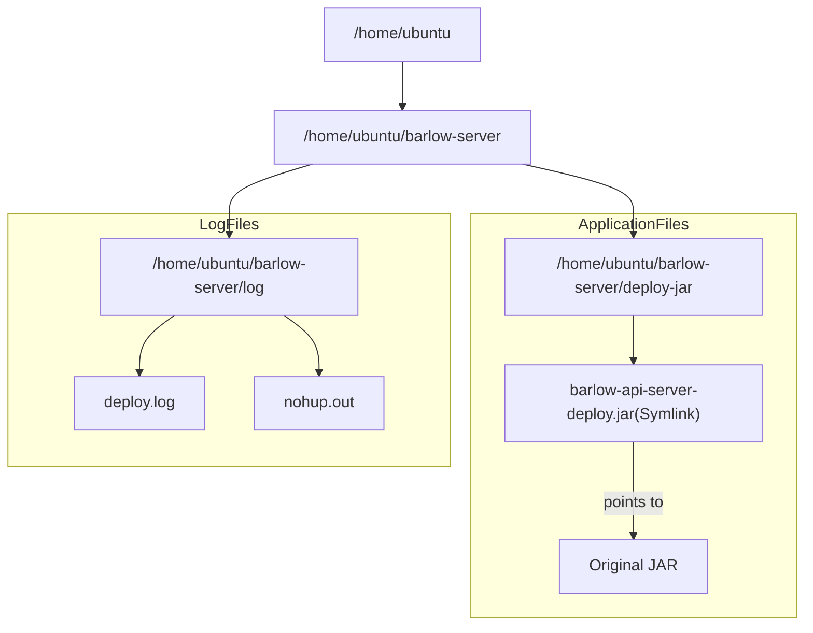

# DEV 서버 배포

이 문서는 Barlow 시스템을 위한 **Continuous Integration/Continuous Deployment (CI/CD)** 파이프라인과 배포 프로세스를 설명합니다. 이 문서는 빌드 구성, 배포 사양
및 애플리케이션을 대상 환경에 배포하는 데 사용되는 스크립트를 다룹니다. 초점은 `AWS CodeBuild` 및 `CodeDeploy` 통합, 배포 스크립트 및 애플리케이션 시작 구성에 맞춰져 있습니다.

## CI/CD Pipeline 개요

Barlow 시스템은 지속적인 통합을 위해 `AWS CodeBuild`를 사용하고, 지속적인 배포를 위해 `AWS CodeDeploy`를 사용하여 코드에서 프로덕션까지 자동화된 파이프라인을 만듭니다.

### Build Configuration

빌드 프로세스는 배포 가능한 아티팩트를 생성하기 위해 `AWS CodeBuild`에서 처리하는 `buildspec-dev.yml` 파일에 정의되어 있습니다.

### 주요 빌드 단계

1. 빌드 프로세스는 `AWS CodeBuild` 서비스에서 시작
2. Gradle wrapper 권한이 실행 파일로 설정
3. Gradle 빌드는 테스트를 실행하지 않고 `core-api` 모듈을 대상으로 함
4. 빌드 아티팩트는 배포를 위해 수집

`buildspec-dev.yml` 파일은 애플리케이션을 구축하기 위한 단계를 정의합니다:

| 단계         | 목적           | 주요 명령어 또는 작업 내용                                                   |
|------------|--------------|-------------------------------------------------------------------|
| build      | 애플리케이션 컴파일   | `./gradlew :core:core-api:clean :core:core-api:build -x test`     |
| post_build | 빌드 마무리 작업 수행 | 완료 메시지 출력, JAR 이름 로깅 등 (예: `echo "Build complete: core-api.jar"`) |

아티팩트 섹션은 배포 패키지에 포함할 파일을 지정합니다:

- `appspec.yml` - 배포 사양
- Core API JAR 파일(`core/core-api/build/libs/*.jar`)
- 배포 스크립트(`scripts/dev/**`)

## 배포 구성

배포 프로세스는 `appspec.yml` 파일에 의해 제어되며, 이 파일은 `AWS CodeDeploy`가 배포 주기를 조정하는 데 사용됩니다.

### 배포 사양

`appspec.yml` 파일에는 다음과 같은 주요 섹션이 포함되어 있습니다:

| 섹션          | 목적              | 설정 내용                                      |
|-------------|-----------------|--------------------------------------------|
| files       | 파일 대상 경로 정의     | 모든 파일을 `/home/ubuntu/barlow-server` 경로로 복사 |
| permissions | 파일 권한 설정        | 소유자를 ubuntu 사용자 및 그룹으로 설정                  |
| hooks       | 배포 생명주기 스크립트 정의 | 배포 단계별 스크립트를 설정                            |

### Lifecycle Hooks

배포 프로세스에는 서로 다른 단계에서 실행되는 세 가지 중요한 후크가 포함됩니다:

1. **AfterInstall**: 현재 실행 중인 애플리케이션을 종료하기 위해 `stop.sh` 을 실행합니다
2. **ApplicationStart**: `deploy.sh` 을 실행하여 새로 배포된 애플리케이션을 시작합니다
3. **ValidateService**: 애플리케이션이 정상인지 확인하기 위해 `healthCheck.sh` 을 실행합니다

## Deployment Scripts

### Application Termination (stop.sh)

`stop.sh` 스크립트는 현재 실행 중인 애플리케이션의 graceful shutdown 을 처리합니다:

1. `lsof`를 사용하여 포트 8080에서 실행 중인 프로세스를 식별
2. 프로세스가 발견되면 `SIGTERM` 신호(kill -15)를 보내 종료
3. 작업을 `/home/ubuntu/barlow-server/log/deploy.log`에 기록

### Application Deployment (deploy.sh)

`deploy.sh` 스크립트는 새 애플리케이션 버전의 배포를 관리합니다:

스크립트의 주요 작업:

> 1. 바로 서버 디렉토리에서 빌드된 JAR 파일을 찾습니다
> 2. JAR 파일을 배포 디렉토리(`/home/ubuntu/barlow-server/deploy-jar/`)에 복사합니다
> 3. 표준화된 이름(`barlow-api-server-deploy.jar`)을 가진 심볼릭 링크를 만듭니다
> 4. `/home/ubuntu/.profile`에서 환경 변수를 가져옵니다
> 5. Java 시스템 속성 및 환경 변수로 애플리케이션을 시작합니다
> 6. 출력을 로그 파일로 리디렉션하고 백그라운드에서 프로세스를 실행합니다

## Server Environment

배포 대상은 다음과 같은 구조를 가진 Linux 서버입니다:

## Deployment Monitoring

배포 프로세스는 배포 상태를 모니터링하는 데 사용할 수 있는 로그를 생성합니다:

| 로그 파일      | 용도             | 위치                                          |
|------------|----------------|---------------------------------------------|
| deploy.log | deploy 프로세스 로그 | `/home/ubuntu/barlow-server/log/deploy.log` |
| nohup.out  | 애플리케이션 시작 로그   | `/home/ubuntu/barlow-server/log/nohup.out`  |

이 로그는 배포 문제를 해결하고 애플리케이션이 올바르게 시작되었는지 확인하는 데 사용됩니다.

## DEV 환경 CI/CD 요약

1. `dev-deploy` 브랜치로의 변경 사항 감지가 CI/CD 파이프라인을 트리거
2. **AWS CodeBuild**는 `buildspec-dev.yml`을 사용하여 애플리케이션을 빌드
3. 빌드 아티팩트는 **AWS CodeDeploy**로 전달
4. **CodeDeploy**는 `appspec.yml`을 사용하여 대상 서버에 배포
5. 실행 중인 애플리케이션이 `stop.sh` 에서 중지
6. 새 버전은 배포되고 `deploy.sh` 으로 시작
7. 애플리케이션은 `healthCheck.sh` 를 통해 검증

이 파이프라인은 배포가 일관되고 반복 가능하며 자동화되도록 보장하여 배포 관련 문제와 다운타임의 위험을 줄입니다.