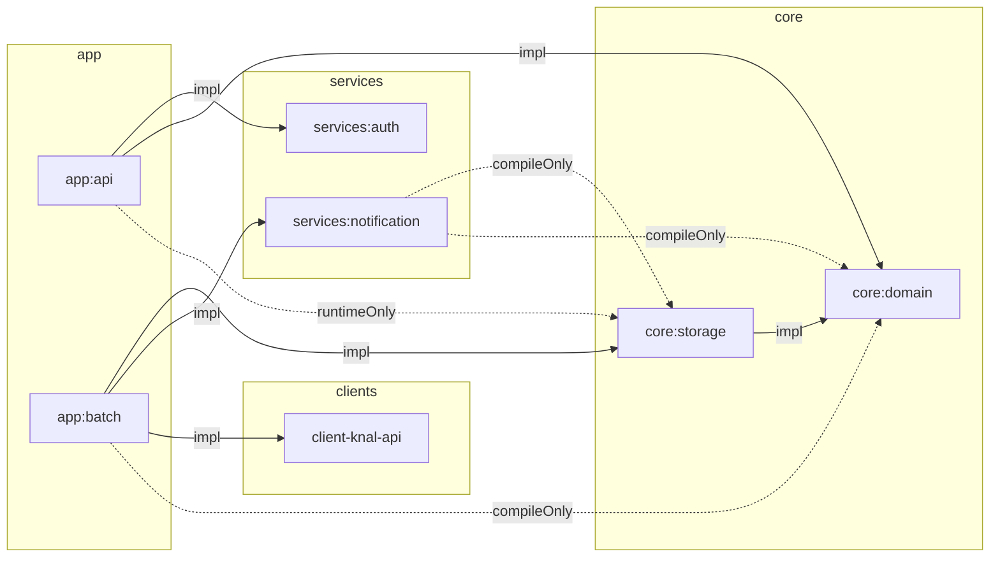

# 개요

이 문서는 Barlow 시스템의 전반적인 아키텍처를 설명하며, 시스템 구성 요소가 어떻게 조직되고 상호 작용하는지에 대한 포괄적인 관점을 제공합니다. 이 문서에서는 시스템의 모듈 구조, 계층 설계에 대해 다룹니다.

## 모듈 구조

> Barlow는 문제를 개별 구성 요소로 분리하여 각 모듈의 독립적인 개발, 테스트 및 배포를 가능하게 하는 모듈형 아키텍처를 따릅니다.

모듈 구조에는 다음이 포함됩니다:

- **app**: `Runnable 한 애플리케이션 관리하는 최상위 모듈`
    - **api**: REST 컨트롤러, 응답 형식 및 API 오류 처리
    - **batch**: 예약된 배치 작업 처리 및 구현
- **core**: 핵심 비즈니스 로직과 API 구성 요소를 포함합니다
    - **domain**: 도메인 모델, 서비스 및 저장소 인터페이스
    - **storage**: 데이터 지속성 관리, JPA 엔티티, 리포지토리 및 리포지토리 어댑터 구현
- **services**:
    - **notification**: 알림 관리 서비스
    - **auth**: 인증 및 권한 부여 서비스
- **clients**: 외부 서비스 통합
    - **client-knal-api**: KNAL (Korean National Assembly Legislative) API 클라이언트
- **support**
    - **logging**: 중앙 집중식 로깅 구성
    - **monitoring**: 시스템 모니터링 서비스
    - **alert**: slack web hook 알림 서비스

## 계층형 구조

Barlow는 서로 다른 시스템 책임 간의 명확한 경계를 가진 계층 구조를 구현합니다:

1. **API 계층(app:api):**
    - 컨트롤러는 HTTP 요청을 처리하고 도메인 서비스에 위임합니다
    - 응답 작성자는 도메인 객체를 API별 응답으로 변환합니다
    - `CoreApiControllerAdvice`을 통한 글로벌 예외 처리
    - `@Async` 및 AsyncExecutor를 통한 비동기 처리 기능

2. **도메인 계층(core:domain):**
    - 인프라 문제와 무관하게 순수한 비즈니스 논리를 포함합니다
    - 도메인 모델은 핵심 비즈니스 엔티티(BillPost, User, Device)를 나타냅니다
    - 저장소 인터페이스는 데이터 액세스 계약을 정의합니다
    - 도메인 서비스는 비즈니스 운영을 구현합니다

3. **영속성 계층(core:storage):**
    - JPA 엔티티를 데이터베이스 테이블에 매핑합니다
    - JPA 저장소는 스프링 데이터 JPA 구현을 제공합니다
    - 저장소 어댑터는 도메인 저장소 인터페이스를 JPA 구현으로 연결합니다

4. **support service:**
    - 모든 계층을 지원하는 cross cutting 문제
    - 중앙 집중식 로깅 구성
    - 중요한 시스템 이벤트에 대한 알림

## 요약

Barlow 시스템 아키텍처는 문제를 명확하게 구분한 모듈식 설계를 따릅니다. 이 시스템은 다음을 사용합니다:

1. **모듈 구조**: 앱, 코어, 클라이언트 및 지원 서비스를 위한 별도의 모듈
2. **Layered Architecture**: API, 도메인, 지속성 계층 간의 경계 명확화
3. **Domain-Driven Design**: 풍부한 도메인 모델과 저장소 인터페이스
4. **Gradle 빌드 시스템**: 일관된 구성의 멀티 모듈 프로젝트

이 아키텍처는 여러 가지 이점을 제공합니다:

- **유지 관리 가능성**: 우려 사항을 명확하게 분리하면 코드베이스를 더 쉽게 이해하고 수정할 수 있습니다
- **테스트 가능성**: 구성 요소는 적절한 mock 으로 분리하여 테스트할 수 있습니다
- **확장성**: 비동기식 처리와 깨끗한 분리로 시스템 확장 가능
- **유연성**: 모듈식 구조를 통해 구성 요소가 독립적으로 발전할 수 있습니다

각 모듈에 대한 자세한 정보는 다음을 참조하세요:

- [app:batch 모듈 README.md](https://github.com/ogongchill/barlow/blob/develop/app/batch/README.md)
- [app:api 모듈 README.md](https://github.com/ogongchill/barlow/blob/develop/app/api/README.md)
- [core:storage 모듈 README.md](https://github.com/ogongchill/barlow/blob/develop/core/storage/README.md)
- [services:notification 모듈 README.md](https://github.com/ogongchill/barlow/blob/develop/services/notification/README.md)
- [support 모듈 README.md](https://github.com/ogongchill/barlow/tree/develop/support)
- [dev-deploy 배포 방법 README.md](https://github.com/ogongchill/barlow/blob/develop/DEV-DEPLOY.md)
