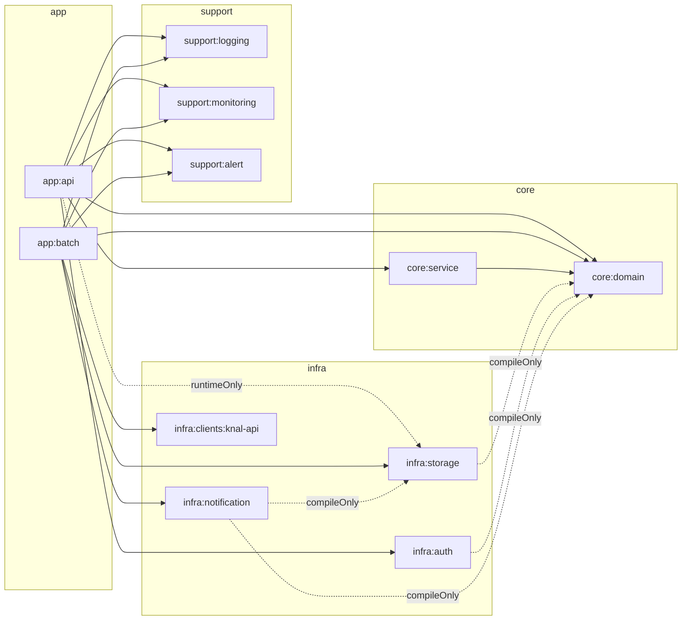

# Barlow

국회 입법 정보를 구독·추적하는 서비스의 백엔드 서버.  
Spring Boot 기반 멀티 모듈 Gradle 프로젝트입니다.

---

## 모듈 구조

```
app:api          — REST API 서버 (진입점)
app:batch        — 배치 작업 서버 (AWS Lambda 기반)

core:domain      — 도메인 모델 · Repository 인터페이스 · 예외
core:service     — 비즈니스 로직 (@Service · @Component)

infra:storage          — JPA 영속성 (Repository 구현체 · 엔티티)
infra:auth             — JWT 발급·검증 · OIDC 소셜 로그인 · Passport
infra:notification     — FCM 푸시 알림 (iOS / Android)
infra:clients:knal-api — 국회 공공 API 클라이언트 (OpenFeign)

batch:batch-admin — 배치 어드민

support:logging    — 로깅 설정
support:monitoring — 모니터링
support:alert      — Slack Webhook 알림

tests:api-docs — REST Docs 테스트 지원
```

### 의존 방향


```mermaid
graph LR
    subgraph app
        app_api["app:api"]
        app_batch["app:batch"]
    end

    subgraph core
        core_domain["core:domain"]
        core_service["core:service"]
    end

    subgraph infra
        infra_storage["infra:storage"]
        infra_auth["infra:auth"]
        infra_notification["infra:notification"]
        infra_knal["infra:clients:knal-api"]
    end

    subgraph support
        sup_log["support:logging"]
        sup_mon["support:monitoring"]
        sup_alert["support:alert"]
    end

    app_api --> core_service
    app_api --> core_domain
    app_api --> infra_auth
    app_api -.->|runtimeOnly| infra_storage
    app_api --> sup_log & sup_mon & sup_alert

    app_batch --> core_domain
    app_batch --> infra_storage
    app_batch --> infra_notification
    app_batch --> infra_knal
    app_batch --> sup_log & sup_mon & sup_alert

    core_service --> core_domain
    infra_storage -.->|compileOnly| core_domain
    infra_auth -.->|compileOnly| core_domain
    infra_notification -.->|compileOnly| core_domain
    infra_notification -.->|compileOnly| infra_storage
```

---

## 계층 설계

| 계층 | 모듈 | 역할 |
|------|------|------|
| **Application** | `app:api`, `app:batch` | HTTP 요청 처리, 배치 잡 실행 |
| **Business** | `core:service` | 트랜잭션 경계, 도메인 로직 조율 |
| **Domain** | `core:domain` | 순수 비즈니스 규칙, Repository 인터페이스 정의 |
| **Infra** | `infra:*` | 영속성·인증·알림·외부 API 구현 |
| **Support** | `support:*` | 로깅·모니터링·알림 공통 인프라 |

의존성은 항상 위에서 아래 방향(`app → core:service → core:domain ← infra`)으로만 흐릅니다.

---

## 모듈별 README

| 모듈 | 문서 |
|------|------|
| `app:api` | [app/api/README.md](app/api/README.md) |
| `core:domain` | [core/domain/README.md](core/domain/README.md) |
| `core:service` | [core/service/README.md](core/service/README.md) |
| `infra:storage` | [infra/storage/README.md](infra/storage/README.md) |
| `infra:auth` | [infra/auth/README.md](infra/auth/README.md) |
| `infra:notification` | [infra/notification/README.md](infra/notification/README.md) |
| `infra:clients:knal-api` | [infra/clients/knal-api/README.md](infra/clients/knal-api/README.md) |
