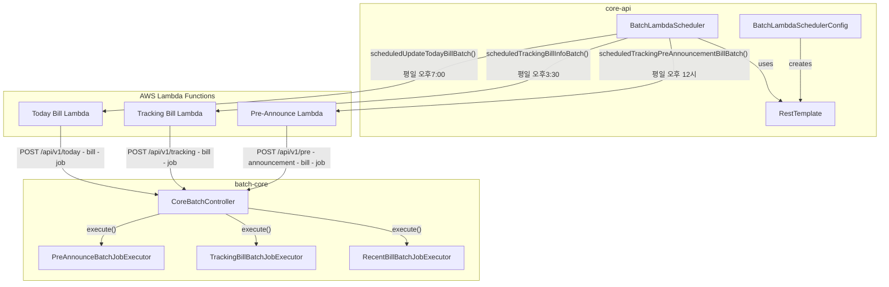
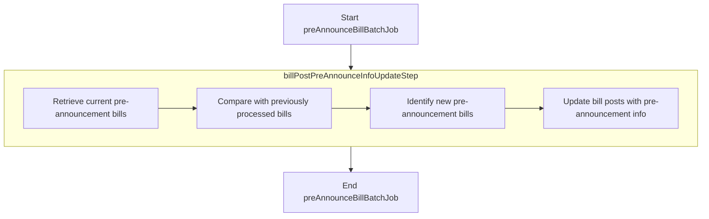
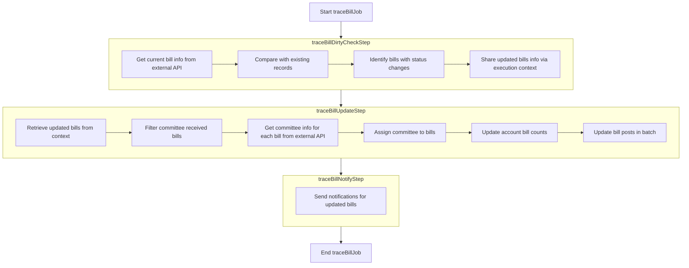
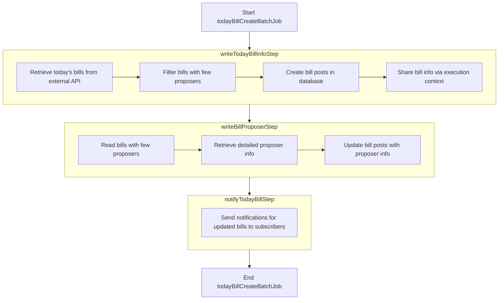

# batch 모듈

이 문서는 Barlow 플랫폼 내 배치 처리 시스템에 대한 포괄적인 개요를 제공합니다. 배치 처리는 법안 정보를 주기적으로 업데이트하고, 입법 변경 사항을 추적하며, 사용자가 관련 법안에 대한 적시 통지를 받을 수
있도록 하는 중요한 구성 요소입니다.

## 개요

Barlow 시스템은 정기적인 배치 처리를 통해 법안 데이터를 최신 상태로 유지하고 사용자에게 최신 정보를 제공합니다. 배치 작업은 외부 소스에서 데이터를 검색하고 내부 데이터베이스를 업데이트하며 사용자 소비를
위한 정보를 준비하기 위해 지정된 간격으로 실행됩니다.

배치 작업 스케줄러는 두 가지 주요 구성 요소로 구성됩니다:

1. **BatchLambdaScheduler**
    - cron 표현식을 사용하여 특정 시간에 작업을 실행하도록 예약하는 스프링 구성 요소
2. **CoreBatchController**
    - 배치 작업을 실행하기 위한 엔드포인트를 제공하는 REST 컨트롤러
    - AWS Lambda 함수를 통해 실행되는 단발성 배치이므로 수동으로 호출되지 않음

## 주요 Batch Job

이 시스템은 세 가지 주요 배치 작업을 구현하며, 각각 최신 법안 정보를 유지하는 데 특정 목적을 달성합니다:

| 배치 작업 이름                  | 목적                              | 실행 시간       | 호출 엔드포인트                            |
|---------------------------|---------------------------------|-------------|-------------------------------------|
| Pre-Announcement Bill Job | 법안이 공식 발의되기 전 사전 공지된 법안을 추적합니다. | 평일 오후 12:00 | `/api/v1/pre-announcement-bill-job` |
| Tracking Bill Job         | 기존 법안 정보를 최신 상태로 갱신합니다.         | 평일 오후 3:30  | `/api/v1/tracking-bill-job`         |
| Today Bill Job            | 오늘의 새로운 법안 목록을 갱신합니다.           | 평일 오후 7:00  | `/api/v1/today-bill-job`            |

### 진행중인 입법 예고 법안 배치

> 이 작업은 법안 입법 예고 정보를 처리하는 배치 작업입니다. `위원회에 회부된 법률안을 심사하기 전에 법률안의 입법 취지와 주요 내용 등을 국민들에게 미리 알리는 절차`를 *
*입법예고** 라 합니다. 해당 배치 작업에서는 입법예고 정보를 가져와서 업데이트 작업을 처리합니다.
> 사용자는 가능한 한 빨리 다가오는 법안에 대한 정보를 계속 얻을 수 있습니다.

1. **현재 입법예고 법안 조회**
    - `PreAnnounceRetrieveClientAdapter`를 통해 외부 API에서 현재 입법 예고 중인 법안 정보 조회
2. **새로운 입법예고 법안 비교**
    - `CurrentPreAnnounceBills`의 `dirtyCheck` 메서드를 사용하여 이전에 처리된 법안과 비교하여 새로운 법안 식별
    - 이전에 처리되지 않은 새로운 법안만 필터링
3. **법안 게시글 업데이트**
    - 새로운 법안 정보를 데이터베이스에 저장하고, 기존 법안 정보를 업데이트
    - 입법예고 링크 URL, 마감일 등의 정보를 업데이트

### 법안 추적 및 업데이트 알림 배치

> 이 작업은 기존 법안의 변경 사항을 추적하여 상태, 진행 상황 및 기타 세부 정보를 업데이트합니다. 시작 날짜 매개변수를 허용하여 법안 업데이트를 얼마나 거슬러 올라갈지 결정합니다.

#### 1. traceBillDirtyCheckStep

1. **현재 법안 정보 조회**
    - 외부 API를 통해 현재 법안 상태 정보를 조회
    - 조회 시작일과 종료일을 파라미터로 설정하여 특정 기간 내 변경된 법안을 조회
2. **상태 변경 법안 식별**
    - 조회한 법안 정보와 데이터베이스에 저장된 정보를 비교
    - 상태가 변경된 법안을 식별하고 `UpdatedBills` 객체에 저장
3. **실행 컨텍스트 공유**
    - 식별된 변경 법안 정보를 Job 실행 컨텍스트에 저장하여 다음 단계와 공유

#### 2. traceBillUpdateStep

이 단계는 변경된 법안 정보를 업데이트하는 핵심 단계입니다.

1. **변경 법안 정보 조회**
    - 이전 단계에서 공유한 실행 컨텍스트에서 변경 법안 정보를 조회
    - 변경 법안이 없는 경우 작업을 종료
2. **소관위원회 접수 법안 필터링**
    - 변경된 법안 중 소관위원회에 접수된 법안을 필터링
    - `filterCommitteeReceived()` 메서드를 사용하여 필터링
3. **소관위원회 정보 조회 및 할당**
    - 소관위원회에 접수된 각 법안에 대해 외부 API를 통해 소관위원회 정보를 조회
    - 조회한 소관위원회 정보를 법안에 할당
4. **계정별 법안 수 업데이트**
    - 소관위원회별 법안 수를 업데이트
    - `accountBatchRepository.updateAccountBillCount()` 메서드를 사용
5. **법안 게시글 일괄 업데이트**
    - 모든 변경 법안 정보를 데이터베이스에 일괄 업데이트
    - `billPostBatchRepository.updateAllInBatch()` 메서드를 사용

#### 3. traceBillNotifyStep

1. **알림 데이터 준비**
    - 변경된 법안 정보를 기반으로 알림 데이터를 준비합니다.
    - 법안 ID, 이름, 상태 변경 정보 등을 포함합니다.
2. **알림 전송**
    - 준비된 알림 데이터를 구독자에게 전송합니다.
    - `NotificationSendPort`를 통해 알림을 전송합니다.

### 오늘 발의된 법안 업데이트 및 알림 배치

> 이 작업은 `오늘 발의된 법안` 목록을 업데이트하여 사용자가 홈 화면에서 최신 정보를 볼 수 있도록 합니다.

#### 1. writeTodayBillInfoStep

1. **오늘 등록된 법안 조회**
    - 외부 API를 통해 오늘 등록된 법안 정보를 조회
    - 조회 날짜를 파라미터로 설정하여 해당 날짜에 등록된 법안만 조회
2. **제안자 정보가 부족한 법안 필터링**
    - 조회한 법안 중 제안자 정보가 부족한 법안을 필터링
    - 이 법안들은 다음 단계에서 추가 정보를 조회
3. **법안 게시글 생성**
    - 조회한 법안 정보를 기반으로 법안 게시글을 생성
    - 법안 ID, 이름, 제안 일자, 진행 상태 등의 정보를 포함
4. **실행 컨텍스트 공유**
    - 생성된 법안 정보와 제안자 정보가 부족한 법안 목록을 Job 실행 컨텍스트에 저장하여 다음 단계와 공유

#### 2. writeBillProposerStep

이 단계는 청크 기반 처리 방식을 사용하여 제안자 정보를 업데이트

1. **제안자 정보 부족 법안 읽기**
    - `BillProposerReader`를 통해 이전 단계에서 식별된 제안자 정보가 부족한 법안을 조회
2. **상세 제안자 정보 조회**
    - 각 법안 ID에 대해 외부 API를 통해 상세 제안자 정보를 조회
    - 제안자 이름, 정당 정보 등을 조회
3. **법안 제안자 정보 업데이트**
    - 조회한 제안자 정보를 법안 게시글에 업데이트
    - `BillProposerWriter`를 통해 데이터베이스에 저장
4. **오류 처리**
    - 외부 API 호출 중 발생할 수 있는 예외를 처리
    - `OpenDataException` 발생 시 해당 항목을 건너뛰고 계속 진행

#### 3. notifyTodayBillStep

1. **알림 데이터 준비**
    - 오늘 등록된 법안 정보를 기반으로 알림 데이터를 준비
    - 법안 진행 상태별로 그룹화하여 알림 주제(Topic)를 결정
2. **알림 전송**
    - 준비된 알림 데이터를 구독자에게 전송
    - `NotificationSendPort`를 통해 알림을 전송
    - 이 단계는 트랜잭션 없이 실행(`PROPAGATION_NEVER`)

## 타 시스템과의 통합

배치 처리 시스템은 Barlow 플랫폼의 여러 다른 구성 요소와 통합됩니다:

- **도메인 계층**: 배치 작업은 도메인 저장소와 상호 작용하여 법안 정보 및 법률 계정을 업데이트합니다
- **AWS Lambda**: 예약된 작업은 확장 가능한 실행을 위해 AWS Lambda 함수를 통해 트리거됩니다
- **알림 시스템**: 업데이트된 법안 정보를 사용하여 가입한 사용자에게 알림을 생성합니다

## 요약

배치 처리 시스템은 Barlow 플랫폼의 중요한 구성 요소로, 법안 정보를 최신 상태로 유지하는 역할을 합니다. 배치 처리 시스템은 예약된 간격으로 실행되는 세 가지 주요 배치 작업으로 구성됩니다:

- **Pre-Announcement Bill Job**: 사전 공지 법안 추적
- **Tracking Bill Job**: 기존 법안 정보 업데이트
- **Today Bill Job**: 오늘의 법안 목록 업데이트

이 작업들은 `cron` 표현식에 의해 예약된 AWS Lambda 함수 호출을 통해 트리거할 수 있습니다.
