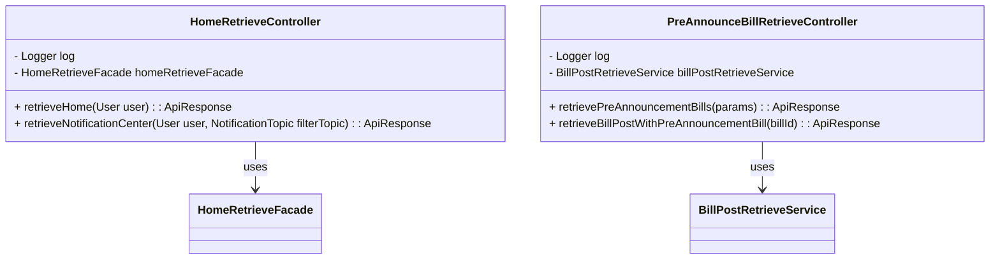
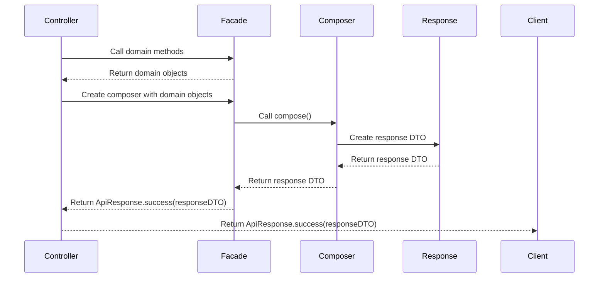

# core-api 모듈

이 문서는 Barlow 시스템 내의 API 계층에 대한 자세한 개요를 제공합니다. API 계층은 클라이언트의 HTTP 요청 을 처리하고, 비즈니스 로직 실행을 위해 도메인 계층과 조정하며, 응답 형식을 적절히 지정합니다.
이 계층은 클라이언트 애플리케이션과 바로우 시스템의 핵심 비즈니스 로직 간의 인터페이스 역할을 합니다.

## 개요

Barlow의 API 계층은 RESTful 원칙을 따르며 Spring Boot의 Web MVC 프레임워크를 사용하여 구축됩니다. 이 계층은 들어오는 요청을 처리하고 일관된 응답을 제공하기 위해 함께 작동하는 여러
주요 구성 요소로 구성되어 있습니다.

## Controller Structure

Barlow API의 컨트롤러는 도메인 개념에 따라 구성되며 일관된 패턴을 따릅니다. 각 컨트롤러:

1. 기본 경로를 정의하기 위해 `@RestController`와 `@RequestMapping`으로 주석을 달았습니다
2. 도메인 외관이나 생성자 주입을 통한 서비스에 따라 달라집니다
3. HTTP 동사 주석(`@GetMapping` 등)으로 주석이 달린 엔드포인트 메서드가 포함되어 있습니다
4. 로거 인스턴스를 사용하여 작업 추적
5. **Composer** 클래스를 사용하여 도메인 객체를 API 응답으로 변환합니다
   다음은 이 구조의 예입니다:



Sources:
- [core/core-api/src/main/java/com/barlow/core/api/controller/v1/home/HomeRetrieveController](https://github.com/ogongchill/barlow/blob/a5b7f9d0/core/core-api/src/main/java/com/barlow/core/api/controller/v1/home/HomeRetrieveController.java#L18-L52)
- [core/core-api/src/main/java/com/barlow/core/api/controller/v1/preannounce/PreAnnounceBillRetrieveController](https://github.com/ogongchill/barlow/blob/a5b7f9d0/core/core-api/src/main/java/com/barlow/core/api/controller/v1/preannounce/PreAnnounceBillRetrieveController.java#L1-L56)

### 컨트롤러에서의 인증
컨트롤러는 사용자 지정 주석 `@PassportUser`를 사용하여 인증된 사용자를 컨트롤러 메서드에 삽입합니다. 
이렇게 하면 `HomeRetrieveController`에 표시된 것처럼 컨트롤러에서 인증 처리가 간소화됩니다:

```java
@GetMapping
public ApiResponse<HomeResponse> retrieveHome(@PassportUser User user) {
    log.info("Received retrieving home information request.");
    LocalDate today = LocalDate.now();
    HomeResponseApiSpecComposer apiSpecComposer = new HomeResponseApiSpecComposer(
        homeRetrieveFacade.retrieveHome(user),
        homeRetrieveFacade.retrieveTodayBillPostThumbnail(today)
    );
    return ApiResponse.success(apiSpecComposer.compose(today));
}
```

## Response Formatting
API 계층은 응답 형식에 일관된 패턴을 사용합니다:

1. **Response DTO**: API 응답을 나타내는 불변 레코드 클래스(예: `HomeResponse`)
2. **Response Composer**: 도메인 객체를 응답 DTO로 변환하는 클래스(예: `HomeResponseApiSpecComposer`)
3. **ApiResponse Wrapper**: 성공과 오류 응답을 표준화하는 일반적인 래퍼



## 도메인 계층과의 통합

API 계층은 파사드와 서비스를 통해 도메인 계층과 통합됩니다. 이 패턴은 API 문제와 비즈니스 논리 사이의 명확한 경계를 제공합니다:

이 패턴에서는:

1. 컨트롤러는 서비스에 직접 의존하지 않고 **facades** 나 **service** 객체에 의존합니다
2. 필요한 경우 여러 **service call** 을 조정하는 파사드
3. 서비스에는 핵심 비즈니스 논리가 포함되어 있습니다
4. **Composer** 는 도메인 객체를 API 응답으로 변환합니다

이 분리는 API 계층이 HTTP 문제에 집중하고 도메인 계층이 비즈니스 로직을 처리하는 데 도움이 됩니다.

## 요약

Barlow 시스템의 API 계층은 클라이언트 애플리케이션이 코어 도메인 로직과 상호 작용할 수 있도록 잘 구조화된 인터페이스를 제공합니다. 이는 일관된 패턴을 따릅니다:

1. 도메인 개념별로 구성된 컨트롤러를 통한 처리 요청
2. **Composer**와 표준화된 응답 구조를 사용한 응답 형식화
3. 중앙 집중식 예외 처리 및 적절한 로깅을 통한 오류 처리
4. `@PassportUser` 주석을 통한 인증
5. 사용자 지정 예외 처리를 통한 비동기 처리

이 설계는 API가 일관되고 유지 가능하며 API와 도메인 계층 간의 명확한 분리를 보장합니다.