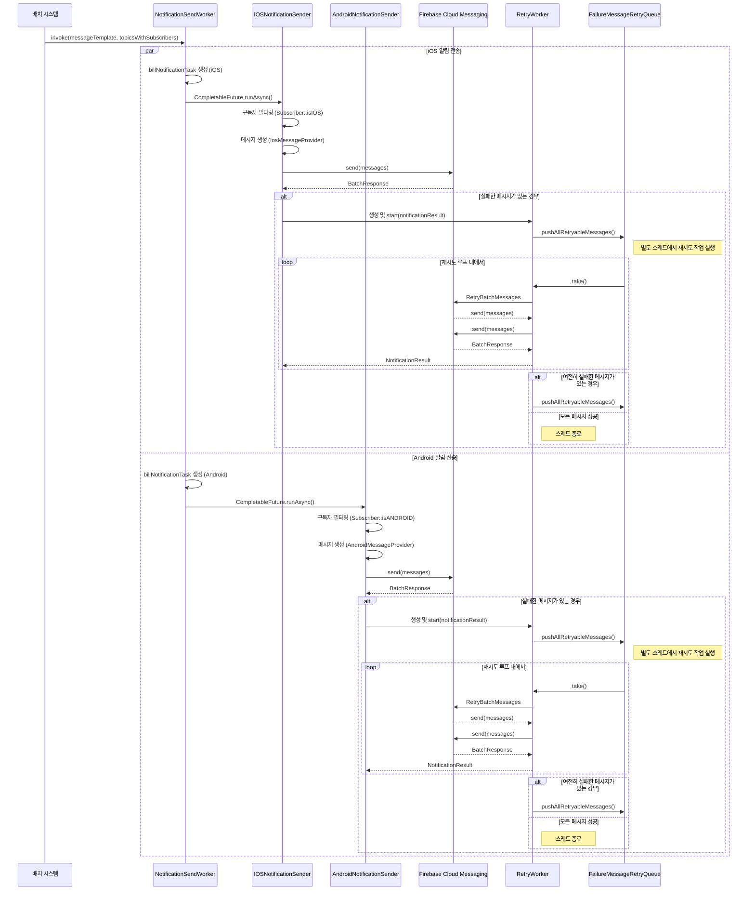

# core-notification 모듈



## 개요

core-notification 모듈은 Barlow 시스템에서 사용자에게 법안 관련 알림을 전송하는 핵심 기능을 담당합니다. 이 모듈은 iOS와 Android 플랫폼 모두에 푸시 알림을 전송하고, 알림 정보를
관리하며, 알림 센터에 알림 항목을 등록하는 기능을 제공합니다.

## 주요 구성 요소

### 1. 알림 전송 시스템

**NotificationSendWorker** <br>
알림 전송의 핵심 컴포넌트로, 비동기적으로 iOS와 Android 기기에 푸시 알림을 전송합니다.

```java
public class NotificationSendWorker {
	private final IOSNotificationSender iosNotificationSender;
	private final AndroidNotificationSender androidNotificationSender;
	private final Executor sendExecutor;

	public NotificationSendWorker(
		IOSNotificationSender iosNotificationSender,
		AndroidNotificationSender androidNotificationSender,
		Executor sendExecutor
	) {
		this.iosNotificationSender = iosNotificationSender;
		this.androidNotificationSender = androidNotificationSender;
		this.sendExecutor = sendExecutor;
	}

	public void invoke(...) {
		// ...
	}
}
```

[core/core-notification/src/main/java/com/barlow/notification/worker/NotificationSendWorker.java](https://github.com/ogongchill/barlow/blob/ade16deda0a862be15172eca92448dd062a8beec/core/core-notification/src/main/java/com/barlow/notification/worker/NotificationSendWorker.java#L18)

#### 주요 기능:

- 비동기 실행기(Executor)를 사용한 병렬 알림 전송
- 플랫폼별(iOS/Android) 알림 전송 처리
- 실패한 알림에 대한 자동 재시도 메커니즘

### 2. 알림 정보 관리

**NotificationInfo** <br>
알림 데이터를 관리하는 클래스로, 주제(Topic)와 구독자(Subscriber) 정보를 매핑하여 저장합니다.

[core/core-notification/src/main/java/com/barlow/notification/NotificationInfo.java](https://github.com/ogongchill/barlow/blob/ade16deda0a862be15172eca92448dd062a8beec/core/core-notification/src/main/java/com/barlow/notification/NotificationInfo.java#L10)

```java
public class NotificationInfo {

	private final Map<Topic, List<Subscriber>> infos;

	public NotificationInfo(Map<Topic, List<Subscriber>> infos) {
		this.infos = infos;
	}

	// methods ...
}
```

#### 주요 기능:

- 주제별 알림 수신자 관리
- 주제별 법안 총 개수 할당
- 대표 법안 이름 및 총 개수 할당

### 3. 알림 센터 등록 시스템

**NotificationCenterRegistrar** <br>
사용자에게 전송된 알림을 알림 센터에 등록하는 역할을 담당합니다.

```java
public class NotificationCenterRegistrar {

	private final NotificationCenterRepository notificationCenterRepository;

	public NotificationCenterRegistrar(NotificationCenterRepository notificationCenterRepository) {
		this.notificationCenterRepository = notificationCenterRepository;
	}

	public void register(...) {
		// ...
	}
}
```

[core/core-notification/src/main/java/com/barlow/notification/NotificationCenterRegistrar.java](https://github.com/ogongchill/barlow/blob/ade16deda0a862be15172eca92448dd062a8beec/core/core-notification/src/main/java/com/barlow/notification/NotificationCenterRegistrar.java#L8)

#### 주요 기능:

- 알림 정보를 알림 센터 항목으로 변환
- 알림 센터에 알림 항목 일괄 등록

### 4. 알림 센터 저장소

**NotificationCenterRepositoryAdapter** <br>
알림 센터 항목을 데이터베이스에 저장하는 역할을 담당합니다.

```java
public class NotificationCenterRepositoryAdapter implements NotificationCenterRepository {
	private final SimpleJdbcInsert simpleJdbcInsert;

	// ...
}
```

#### 주요 기능:

- 알림 센터 항목 일괄 등록

## 기술적 특징

- **비동기 처리**: `CompletableFuture`와 전용 `Executor`를 사용하여 알림 전송을 비동기적으로 처리함으로써 시스템 성능에 미치는 영향을 최소화합니다.
- **재시도 메커니즘**: 알림 전송 실패 시 `RetryWorker`를 통해 자동으로 재시도합니다.
- **멀티 플랫폼 지원**: iOS와 Android 플랫폼에 대한 알림 전송을 모두 지원합니다.
- **배치 시스템 통합**: 배치 시스템과 통합되어 법안 업데이트를 감지하고 알림을 생성합니다.

## DB 접근 분리

> `core-notification` 모듈은 **법안 업데이트를 감지하고 알림을 생성하는 배치 작업과 연동**되어 동작하는 특징을 가집니다. 이에 따라 앱의 전반적인 비즈니스에 사용되는 데이터 모델은
`storage:db-core` 모듈에서 관리되도록 하고, 부가적인 서비스로서 수집 및 정제되는 영역에서 사용되는 데이터 모델을 분리하여 관리할 수 있도록 `core-notification` 모듈 하위에 패키징을
> 통해 논리적 분리를 했습니다. <br> <br>
> 이러한 논리적 분리는 다음과 같은 이점을 제공합니다:
> 1. **책임 분리**: 핵심 비즈니스 모델(`storage:db-core`)과 알림 관련 모델(`core-notification` 하위)의 책임을 명확히 구분합니다.
> 2. **유지보수성 향상**: 알림 시스템의 데이터 모델 변경이 핵심 비즈니스 로직에 미치는 영향을 최소화합니다.
> 3. **확장성**: 알림 시스템의 요구사항 변화에 따라 독립적으로 데이터 모델을 발전시킬 수 있습니다.

> 즉, 물리적으로는 동일한 데이터베이스를 사용하여 리소스를 효율적으로 활용하면서도, 논리적 분리를 통해 각 영역의 역할과 책임을 명확히 하는 아키텍처를 구현하기 위함입니다.

### 데이터 모델

알림 시스템은 다음과 같은 주요 데이터 엔티티를 사용합니다:

1. **NotificationConfigJpaEntity**: 사용자의 알림 설정을 저장
2. **NotificationCenterItemJpaEntity**: 사용자에게 전송된 알림 항목을 저장

## 사용자 알림 설정 관리

사용자가 계정을 생성할 때 기본 알림 설정이 자동으로 활성화됩니다

## 요약

`core-notification` 모듈은 Barlow 시스템에서 사용자에게 법안 업데이트 알림을 전송하는 핵심 기능을 담당합니다. 이 모듈은 알림 설정 관리, 알림 정보 구성, 알림 센터 등록, 그리고 실제 알림
전송 과정을 처리하며, 비동기 처리와 재시도 메커니즘을 통해 안정적인 알림 서비스를 제공합니다.