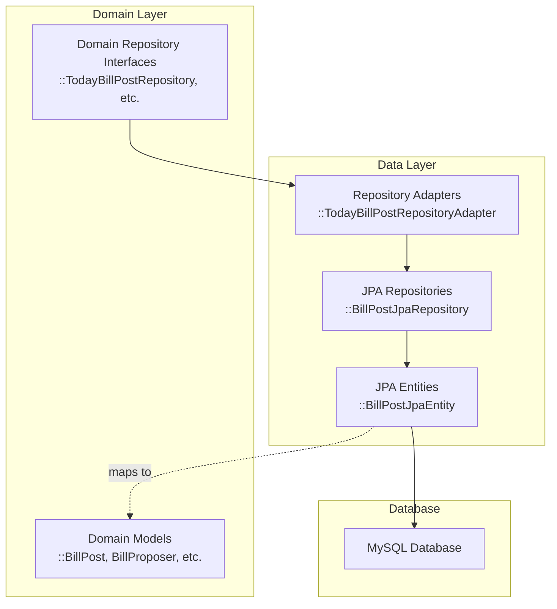
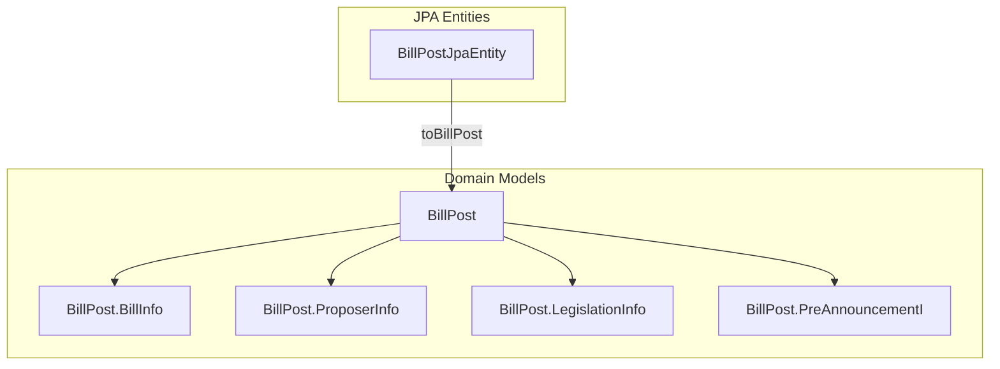
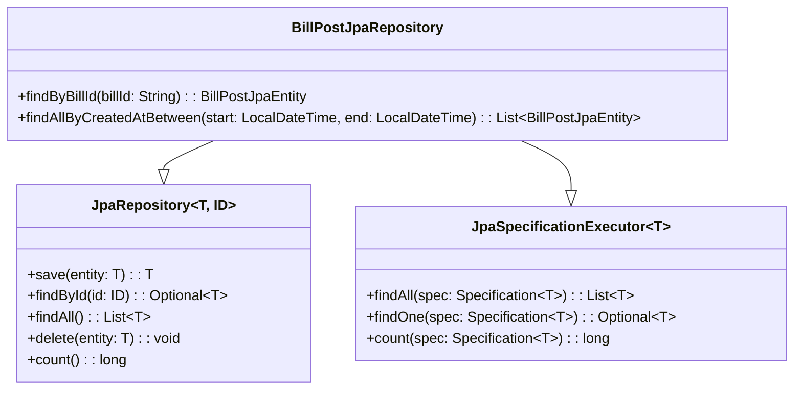
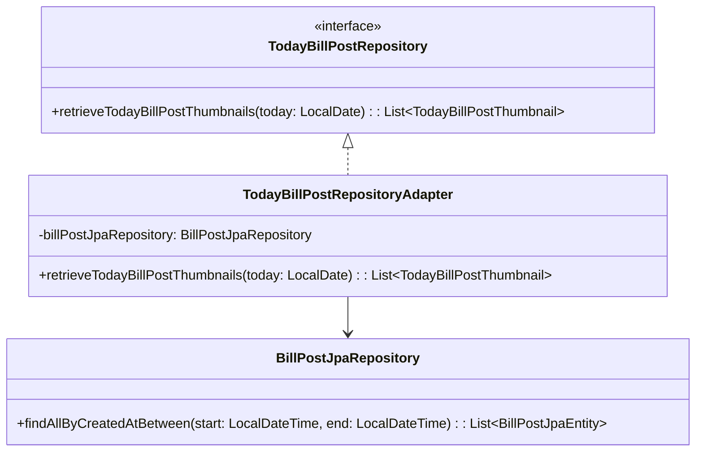

# db-core 모듈

Barlow 시스템의 데이터 계층은 모든 비즈니스 엔티티의 영속성과 **Persistence Entity** 와 **Domain Entity** 간의 **_translation_** 을 담당합니다.
이 문서에서는 JPA 엔티티, repository 및 repository adapter 를 중심으로 데이터 영속성 계층에 사용되는 아키텍처, 구성 요소 및 패턴을 개략적으로 설명합니다.

## 개요

데이터 계층은 도메인 모델과 데이터베이스 간의 격차를 해소하여 데이터 무결성과 효율적인 데이터 액세스를 보장하면서 문제를 깔끔하게 분리합니다. 도메인 계층이 영속성 문제로부터 자유롭게 유지하면서 모든 데이터베이스
상호작용을 처리합니다.

엔티티 모델에 대한 자세한 내용은 엔티티 모델을 참조하세요.

## 데이터 계층 아키텍처

Barlow 시스템의 데이터 계층은 깨끗한 아키텍처 접근 방식을 따르며, 명확한 구분이 필요합니다:

1. **JPA Entities** - 영속성을 위한 주석이 있는 데이터베이스 매핑 개체
2. **JPA Repositories** - 데이터 액세스 작업을 제공하는 인터페이스
3. **Repository 어댑터** - 도메인 리포지토리와 JPA 리포지토리를 연결하는 구성 요소
4. **Domain Entities** - 영속성 문제와 무관한 비즈니스 객체

데이터 계층은 repository 패턴을 구현하여 Domain Layer 에 데이터 접근 기술을 노출하지 않고도 도메인 객체를 영속화하고 조회할 수 있게 합니다. Repository Adapter 는 domain
repository interface 를 구현 하며, 내부적으로 JPA 저장소를 사용하여 실제 데이터베이스 작업을 수행합니다.

## JPA Entities

JPA Entity는 Barlow 시스템의 영속성 모델로, 데이터베이스 테이블과 그 관계를 나타냅니다.
이러한 엔티티는 데이터베이스 테이블, 열 및 관계에 대한 매핑을 정의하기 위해 JPA 주석으로 주석이 달려 있습니다.

### 엔티티 구조 다이어그램

`BillPostJpaEntity`는 데이터베이스에서 법안 ID, 법안 이름, 제안자 정보, 법률 정보 등 다양한 필드를 포함하는 법안 게시물을 나타냅니다. 
`BaseTimeJpaEntity`는 공통 시간 관련 필드를 포함하도록 확장됩니다. 
또한 사전 공지 관련 데이터를 위한 사전 공지 정보 클래스도 포함되어 있습니다.

## JPA Entity -> Domain Entity 매핑

**데이터 레이어에서는 JPA 엔티티를 도메인 엔티티로의 단방향 매핑을 처리합니다.** 
이 매핑은 JPA 엔티티가 데이터베이스 매핑을 처리하는 동안 도메인 모델이 영속성 문제에서 자유롭게 유지되도록 보장합니다.

### 매핑 다이어그램

JPA 엔티티의 매핑 방법, 예를 들어 `BillPostJpaEntity`의  `toBillPost()`은 영속성 모델과 도메인 모델 간의 변환을 처리합니다. 이 변환은 영속성 문제가 도메인 계층으로 유출되지 않도록 보장합니다.

## 저장소 계층

저장소 계층은 데이터 액세스 작업을 위한 인터페이스를 제공합니다. 바로우 시스템은 스프링 데이터 JPA 저장소를 사용하여 최소한의 보일러플레이트 코드로 데이터 액세스를 간소화합니다.

### JPA Repository

JPA 저장소는 표준 CRUD 작업과 쿼리 기능을 제공하기 위해 `JpaRepository` 및 `JpaSpecificationExecutor`와 같은 Spring Data JPA 인터페이스를 확장합니다.

`BillPostJpaRepository`는 `JpaRepository`와 `JpaSpecificationExecutor`를 확장하여 표준 CRUD 작업과 복잡한 쿼리에 사양을 사용할 수 있는 기능을 제공합니다. 
또한 특정 비즈니스 요구 사항에 대한 맞춤형 쿼리 방법도 정의합니다.

## Repository Adapter

Repository Adapter는 도메인 저장소 인터페이스를 구현하고 내부적으로 `JpaRepository`를 사용하여 데이터베이스 작업을 수행합니다. 이 어댑터들은 도메인 계층과 영속성 계층을 연결하는 다리 역할을 합니다.

### 어댑터 패턴 구현

어댑터 패턴은 JPA 저장소와의 도메인 저장소 인터페이스를 구현하는 데 사용됩니다. 
예를 들어, `TodayBillPostRepositoryAdapter`는 `TodayBillPostRepository`를 구현하고
`BillPostJpaRepository`를 사용하여 법안 게시물을 검색한 후 도메인 객체로 변환한 후 반환합니다.

### 리포지토리 어댑터 예제

`TodayBillPostRepositoryAdapter` 에서 `retrieveTodayBillPostThumbnails` 메서드는 어댑터 패턴을 보여줍니다:

1. 입력 LocalDate를 LocalDateTime 범위로 변환합니다
2. JPA repository를 사용하여 해당 범위 내의 엔티티를 찾습니다
3. JPA 엔티티를 도메인 객체에 매핑합니다
4. 도메인 객체 목록을 반환합니다

이 접근 방식은 도메인 계층을 영속성 문제로부터 자유롭게 유지하면서 필요한 데이터 액세스 기능을 제공합니다.

## 데이터베이스 Configuration

Barlow 시스템은 MySQL을 기본 데이터베이스로 사용하고 H2를 테스트 목적으로 사용합니다.
데이터베이스 구성은 스프링 부트의 자동 구성을 통해 처리되며, 특정 설정은 `db-core.yml` 에 정의되어 있습니다.

데이터 계층의 데이터베이스 구성에는 다음이 포함됩니다:

1. **MySQL**: 프로덕션 환경을 위한 기본 데이터베이스
2. **H2**: 테스트 및 개발을 위한 인메모리 데이터베이스

### 데이터베이스 종속성

데이터 계층의 종속성은 `build.gradle` 파일에 정의되어 있으며, 여기에는 다음이 포함됩니다:

- JPA 지원을 위한 Spring Boot Data JPA starter
- MySQL 데이터베이스 연결을 위한 MySQL Connector
- 테스트 중 인메모리 데이터베이스 지원을 위한 H2 데이터베이스

이 구성은 일관된 데이터 접근 패턴을 유지하면서 다양한 환경에서 유연한 데이터베이스 사용을 가능하게 합니다.

## 요약

바로우 시스템의 데이터 계층은 깨끗한 아키텍처 원칙에 따라 견고하고 유연한 영속성 메커니즘을 제공합니다.

1. **Clean Architecture**: 도메인과 영속성 문제 간의 명확한 분리
2. **Repository Pattern**: JPA 리포지토리 구현과 도메인 리포지토리 인터페이스
3. **Adapter Pattern**: 도메인 및 영속성 계층을 연결하는 리포지토리 어댑터
4. **엔티티 구분**: 도메인 엔티티와 JPA 엔티티 간의 변환
5. **유연한 데이터베이스 구성**: 다양한 환경에서 다양한 데이터베이스 지원

이 아키텍처는 영속성 메커니즘이 비즈니스 논리와 독립적으로 발전할 수 있도록 보장하여 유지 관리 가능하고 테스트 가능한 데이터 계층을 제공합니다.