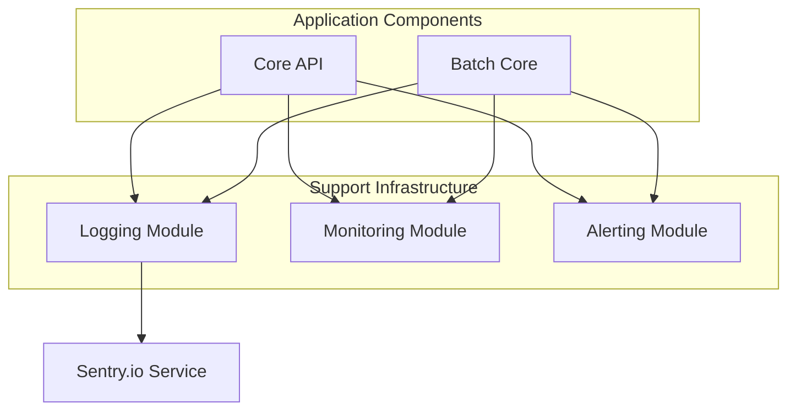
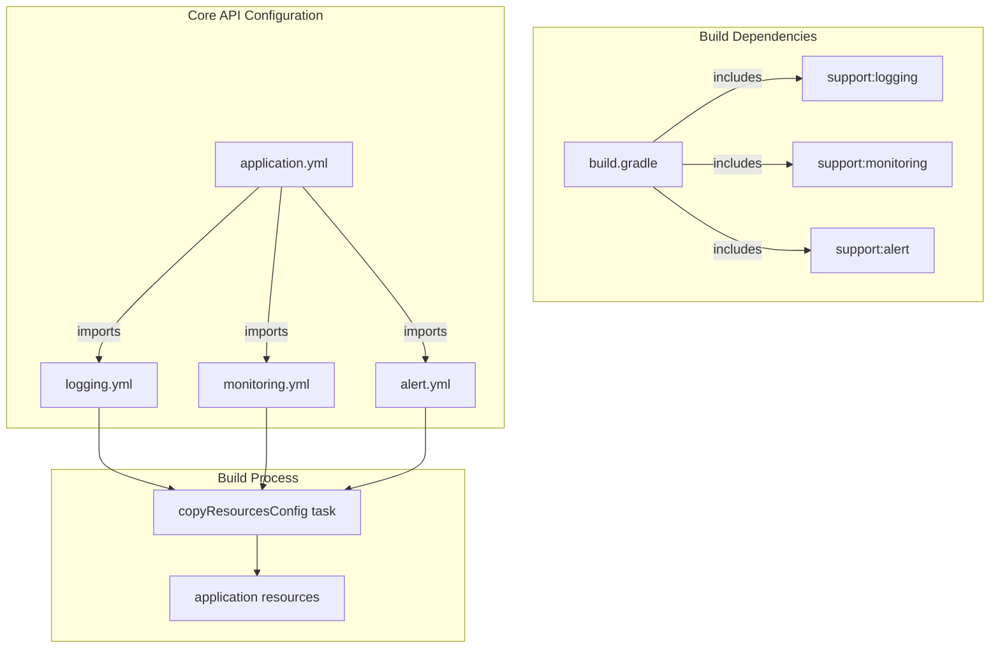

# support 모듈

support 인프라 모듈은 Barlow 애플리케이션의 운영 가시성, 문제 해결 기능 및 운영 시스템 모니터링을 가능하게 하는 필수적인 cross-cutting 서비스를 제공합니다.
이 문서에서는 Barlow 운영 지원 인프라의 백본을 구성하는 로깅, 모니터링 및 알림 하위 시스템에 대해 다룹니다.

CI/CD 파이프라인 및 배포 프로세스에 대한 자세한 내용은 CI/CD 및 배포를 참조하십시오.

## 개요

지원 인프라는 세 가지 주요 구성 요소로 구성됩니다:

1. **Logging System**: 콘솔 출력 및 Sentry 통합을 포함한 환경 전반에 걸쳐 애플리케이션 로깅을 구성
2. **Monitoring System**: 런타임 성능 지표 및 시스템 상태 정보 제공
3. **Alerting System**: 중요한 이벤트나 오류가 발생할 때 알림을 활성화

이 구성 요소들은 핵심 애플리케이션 구성 요소들이 가져온 별도의 모듈로 구현됩니다.

## Module Integration

지원 인프라 모듈은 별도의 Gradle 모듈로 정의되며, 이를 필요로 하는 애플리케이션 구성 요소에 의해 가져옵니다. 이러한 support 모듈의 구성은 Spring의 구성 가져오기 메커니즘을 통해 가져옵니다.

## 로깅 시스템

로깅 시스템은 `support` 인프라에서 구조화된 로깅, 환경별 구성, **Sentry** 오류 추적 플랫폼과의 통합을 제공합니다.

## 모니터링 시스템

모니터링 시스템의 애플리케이션 구성 및 빌드 종속성을 보면 **Spring Boot Actuator**와 통합되어 다음을 제공합니다:

- System health 정보
- Application metrics
- Runtime 인사이트
- JVM 통계

모니터링 구성은 `monitoring.yml` 파일과 해당 Gradle 모듈 종속성을 통해 가져옵니다.

## 알림 시스템

알림 시스템은 모듈의 애플리케이션 구성 및 빌드 종속성을 보면, **slack webhook** 을 사용해 특정 상황에 알림을 보내도록 합니다.

경고 구성은 `alert.yml` 파일과 해당 Gradle 모듈 종속성을 통해 가져옵니다.

## 구성 관리

support 인프라 구성은 스프링 부트의 profile 기반 구성 접근 방식을 따르며, 다양한 환경에 따라 다양한 설정을 제공합니다:

- **local:** 로컬 머신 개발
- **local-dev:** 추가 디버깅을 통해 향상된 로컬 개발
- **dev:** 개발 서버 환경
- **staging:** 사전 제작 테스트 환경
- **live:** 프로덕션 환경

이러한 프로필은 각 환경 컨텍스트에 적합한 로깅, 모니터링 및 알림 동작을 보장합니다.