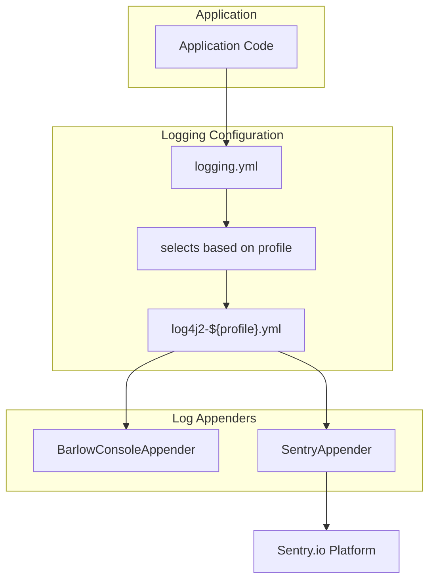
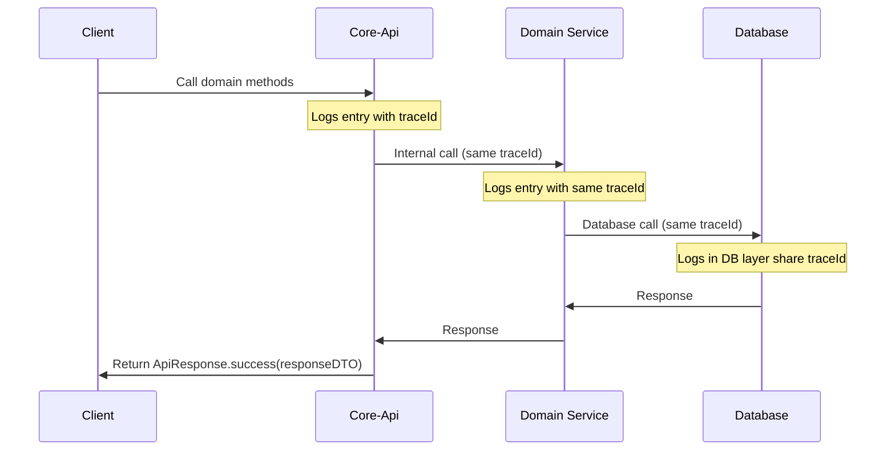
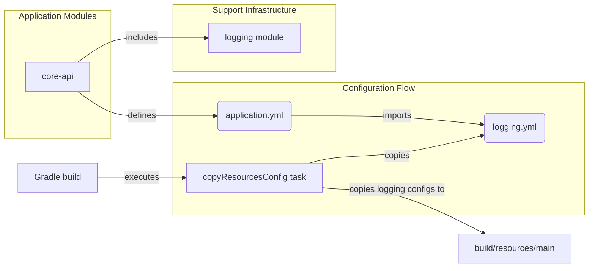

# support:logging 모듈

이 문서는 Barlow 애플리케이션 전반에 걸쳐 사용되는 로깅 인프라에 대해 자세히 설명합니다.
로깅 시스템은 구조화된 로깅 기능, 콘솔 출력 형식 지정, Sentry 통합을 통한 오류 추적을 제공하며 분산 추적을
지원합니다. 이 문서에서는 로깅 시스템의 구성, 구성 요소 및 사용에 대해 다룹니다.

## 아키텍처 개요

Barlow 로깅 시스템은 Log4j2를 기반으로 구축되었으며, 프로파일 기반 구성 접근 방식을 통해 환경(로컬, 개발, 스테이징, 프로덕션) 간에 다양한 로깅 동작을 수행할 수 있습니다. 이 시스템은 로컬 개발을
위한 콘솔 출력과 더 높은 환경에서 오류 추적을 위한 Sentry 통합을 제공합니다.



## Configuration 구조

Barlow의 로깅 구성은 계층적 접근 방식을 따릅니다:

1. 애플리케이션은 스프링 구성에서 logging.yml을 가져옵니다
2. logging.yml은 활성 스프링 프로필을 기반으로 사용할 Log4j2 구성 파일을 결정합니다
3. 프로필별 Log4j2 구성 파일은 부록, 로거 및 패턴을 정의합니다

각 환경에는 적절한 로그 레벨과 형식을 갖춘 맞춤형 로깅 구성이 있습니다.

## Sentry 통합

Barlow 시스템은 오류 추적 및 중앙 집중식 로그 분석을 위해 Sentry와 통합됩니다.
Sentry Appender는 `non-local 환경`에서 구성됩니다

```yaml
Sentry:
  name: SentryAppender
  dsn: ${sys:SENTRY_DSN}
  contextTags: "traceId,spanId,server,api,user"
  minimumEventLevel: "WARN"
  minimumBreadcrumbLevel: "INFO"
```

주요 구성 요소:

- **DSN**: 시스템 속성 `SENTRY_DSN` 에서 검색됨
- **Context tags**: 추적 정보와 사용자 컨텍스트 포함
- **Event level**: WARN 및 더 높은 로그 레벨만 이벤트로 전송됩니다
- **Breadcrumb level**: 정보 및 상위 로그는 브레드크럼으로 기록됩니다

## 분산 추적 support

로깅 시스템은 강력한 분산 추적 지원을 제공하며, 로그에서 추적 및 span ID를 캡처하고 표시하여 서비스 전반에 걸친 요청 흐름 추적을 가능하게 합니다.



Tracing은 `local-dev` 프로필의 `logging.yml` 파일에 구성되어 있습니다.

```yaml
management:
  tracing:
    sampling:
      probability: 1.0
    enabled: true
```

## Logger Configuration

로깅 시스템은 여러 유형의 로깅을 정의합니다:

1. **Root Loggers**: 모든 애플리케이션 로깅을 위한 기본 로거
2. **BarlowAsyncLogger**: 고처리량 로깅을 위한 비동기 로거

```yaml
Loggers:
  Root:
    level: info
    AppenderRef:
      - ref: BarlowConsoleAppender
      - ref: SentryAppender
  AsyncLogger:
    - name: BarlowAsyncLogger
      level: debug
      additivity: false
      includeLocation: false
```

## 애플리케이션 구성 요소와의 통합

로깅 시스템은 Spring configuration import 메커니즘을 통해 다양한 애플리케이션 구성 요소와 통합됩니다. 이를 통해 모든 모듈에서 일관된 로깅 동작을 보장합니다.



필요한 모든 로깅 구성 파일은 `copyResourcesConfig` Gradle 작업을 사용하여 빌드 프로세스 중에 복사됩니다:

```groovy
tasks.register('copyResourcesConfig', Copy) {
    from project(':support:logging').file('src/main/resources')
    // other config sources...
    into file("$projectDir/build/resources/main")
    include '*.yml'
}
```

## 요약

바로우 로깅 시스템은 다음을 제공합니다:

1. 프로필별 로깅 구성
2. 로컬 개발을 위한 컬러화되고 형식화된 콘솔 출력
3. 오류 추적을 위한 `Sentry` 와의 통합
4. 분산 추적 지원
5. 고성능 시나리오를 위한 비동기 로깅 기능

이 포괄적인 접근 방식은 개발자가 개발 중에 필요한 정보를 확보하는 동시에 문제 해결 및 모니터링을 위한 견고한 프로덕션 로깅을 제공합니다.